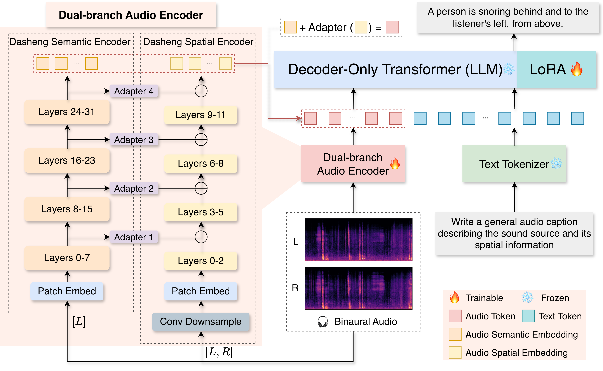

# MiDashengLM-Spatial

***Unifying General Audio Understanding and Spatial Awareness***

[](https://arxiv.org/abs/2610.11156)&nbsp;&nbsp;[](https://huggingface.co/mispeech/midashenglm-spatial)&nbsp;&nbsp;[](???)&nbsp;&nbsp;[](https://github.com/xiaomi-research/midashenglm-spatial)

## Overview

**MiDashengLM-Spatial**, to our knowledge, is the **first open-source end-to-end** **unified** audio-language model that supports both **general audio understanding** and **spatial awareness** within a single architecture. It extends [MiDashengLM](https://github.com/xiaomi-research/dasheng-lm) with **Spatial-Dasheng** through a **hierarchical semantic-to-spatial conditioning (HSSC)** module to separately capture and effectively integrate semantic and spatial audio information. This design enables binaural perception and spatial audio understanding capabilities while preserving general audio understanding capabilities of the base model.

## Highlights

- **Unified general audio understanding and spatial awareness**: The unified audio-language model that supports both general audio understanding and spatial awareness within a single architecture.
- **Spatial-Dasheng** : A spatial audio encoder that performs frame-wise detection and localization of overlapping sound events.
- **Hierarchical Semantic-to-Spatial Conditioning (HSSC)**: A conditioning mechanism that hierarchically conveys intermediate semantic representations from the semantic branch to corresponding layers of the spatial branch, allowing spatial modeling to leverage semantic context while preserving the functional separation of the two branches.
- **Scalable spatial-scene synthesis**: A data pipeline that constructs 1M spatial acoustic scenes (~13,000 hours) involving environmental sounds, speech, and music, together with rich scene-level spatial descriptions and 6M fact-verified QA pairs.
- **Robust spatial perception without compromising generality**: Extensive experiments demonstrate that Spatial-Dasheng delivers robust spatial perception and sim-to-real generalization, while MiDashengLM-Spatial acquires spatial awareness without sacrificing general audio understanding.

## Architecture



## Benchmarking

### Spatial Benchmarks

> - Spatial-audio benchmarks: the spatial-audio subset of MMAU-Pro, and the Spatial Reasoning subset of STAR-Bench.
> - Channel-swap ACR (all-correct rate) refers to the proportion of QA items—whose correct answer hinges exclusively on whether the sound source is heard to the listener's left or right—that are answered correctly under both the original channel order and a left–right channel-swapped copy of the audio.

#### STAR-Bench (Spatial Reasoning)

| Model                            | Size | Audio Format | Spatial Acc.   | Option-Swap ACR | Channel-Swap ACR |
| -------------------------------- | ---- | ------------ | -------------- | --------------- | ---------------- |
| Random Guess                     | -    | -            | 33.3           | 3.7             | 11.1             |
| Human                            | -    | -            | 73.7           | -               | -                |
| Gemini-3.6-Flash                 | -    | Mono         | 47.0           | 23.1            | 10.5             |
| MiMo-V2.5                        | -    | Mono         | 43.8           | 12.4            | 16.9             |
| Qwen3-Omni-30B-A3B-Instruct      | 30B  | Mono         | 44.7           | 17.3            | 0.0              |
| Qwen2.5-Omni-7B                  | 7B   | Mono         | 37.3           | 12.0            | 0.0              |
| MOSS-Audio-8B-Instruct           | 8B   | Mono         | 41.7           | 8.2             | 0.0              |
| Audio-Flamingo-Next-Instruct     | 8B   | Mono         | 24.2           | 7.4             | 0.0              |
| BAT                              | 7B   | Binaural     | 0.0            | 0.0             | 0.0              |
| MiDashengLM-7B-1021              | 8B   | Mono         | 44.3           | 20.3            | 0.0              |
| **MiDashengLM-Spatial-7B** | 8B   | Binaural     | **70.3** | **64.1**  | **72.6**   |

#### MMAU-Pro

| Model                            | Size | Audio Format | Full-set Score | Spatial Acc.   | Channel-Swap ACR |
| -------------------------------- | ---- | ------------ | -------------- | -------------- | ---------------- |
| Random Guess                     | -    | -            | 23.4           | 21.2           | 13.5             |
| Human                            | -    | -            | 77.9           | 88.2           | -                |
| Gemini-3.6-Flash                 | -    | Mono         | **70.4** | 48.3           | 12.8             |
| MiMo-V2.5                        | -    | Mono         | 65.1           | 43.1           | 14.2             |
| Qwen3-Omni-30B-A3B-Instruct      | 30B  | Mono         | 60.6           | 36.6           | 0.0              |
| Qwen2.5-Omni-7B                  | 7B   | Mono         | 52.2           | 41.2           | 0.0              |
| MOSS-Audio-8B-Instruct           | 8B   | Mono         | 57.5           | 26.8           | 0.0              |
| Audio-Flamingo-Next-Instruct     | 8B   | Mono         | 56.9           | 37.2           | 0.7              |
| BAT                              | 7B   | Binaural     | 24.8           | 23.7           | 7.4              |
| MiDashengLM-7B-1021              | 8B   | Mono         | 55.9           | 18.2           | 0.0              |
| **MiDashengLM-Spatial-7B** | 8B   | Binaural     | 56.4           | **55.4** | **33.1**   |

### Monaural Benchmarks

> General audio understanding results on various monaural-audio benchmarks, including audio question answering, automatic speech recognition and audio captioning.

#### Audio Question Answering

| Model                            | MMAU-Pro       | MMAU-v05.15.25 | MuChoMusic     | MusicQA        | AudioCaps-QA   |
| -------------------------------- | -------------- | -------------- | -------------- | -------------- | -------------- |
| Qwen2.5-Omni-7B                  | 52.2           | 71.5           | 64.8           | 60.6           | 53.3           |
| MOSS-Audio-8B-Instruct           | **57.5** | **76.7** | 70.0           | 59.3           | 45.6           |
| Audio-Flamingo-Next-Instruct     | 56.9           | 71.4           | 75.6           | 57.2           | 49.8           |
| MiDashengLM-7B-1021              | 55.9           | 74.9           | 73.0           | **61.6** | **54.2** |
| **MiDashengLM-Spatial-7B** | 56.4           | 74.8           | **76.7** | 56.8           | 52.5           |

#### Automatic Speech Recognition

| Model                            | LibriSpeech test-clean | LibriSpeech test-other | AISHELL-2 Mic | AISHELL-2 iOS | AISHELL-2 Android | GigaSpeech2 Indonesian | GigaSpeech2 Thai | GigaSpeech2 Vietnamese |
| -------------------------------- | ---------------------- | ---------------------- | ------------- | ------------- | ----------------- | ---------------------- | ---------------- | ---------------------- |
| Qwen2.5-Omni-7B                  | 1.7                    | 3.4                    | **2.5** | **2.6** | **2.7**     | 21.2                   | 53.8             | 18.6                   |
| MOSS-Audio-8B-Instruct           | 2.3                    | 5.6                    | 2.9           | 3.0           | 3.0               | 51.0                   | 66.0             | 40.1                   |
| Audio-Flamingo-Next-Instruct     | **1.5**          | **2.8**          | 8.7           | 8.3           | 7.5               | 36.4                   | >100             | 59.9                   |
| MiDashengLM-7B-1021              | 3.6                    | 5.9                    | 3.2           | 2.9           | 3.1               | 22.3                   | 38.4             | 17.7                   |
| **MiDashengLM-Spatial-7B** | 1.8                    | 4.2                    | 3.1           | 2.9           | 3.2               | **20.9**         | **37.4**   | **16.2**         |

#### Audio Captioning

| Model                            | MusicCaps      | Songdescriber  | AudioCaps      | ClothoV2       | AutoACD        |
| -------------------------------- | -------------- | -------------- | -------------- | -------------- | -------------- |
| Qwen2.5-Omni-7B                  | 43.7           | 45.3           | 60.8           | 47.6           | 55.9           |
| MOSS-Audio-8B-Instruct           | 50.6           | 54.4           | 46.4           | 37.8           | 43.8           |
| Audio-Flamingo-Next-Instruct     | 56.2           | **55.4** | **64.0** | 48.6           | 53.2           |
| MiDashengLM-7B-1021              | 59.1           | 46.4           | 62.1           | 49.4           | **67.1** |
| **MiDashengLM-Spatial-7B** | **60.0** | 48.4           | 62.8           | **49.7** | 66.0           |

## Installation

```bash
conda create -n midashengspatial python=3.13 -y && conda activate midashengspatial
pip install -r requirements.txt # INFER ENV
conda create -n nvembed python=3.11 -y && conda activate nvembed
pip install -r eval/requirements-score.txt # EVAL ENV
```

## Usage

```python
import torch
from transformers import AutoModelForCausalLM, AutoProcessor

model_id = "mispeech/midashenglm-spatial"  # or a local package directory
model = AutoModelForCausalLM.from_pretrained(model_id, trust_remote_code=True)
processor = AutoProcessor.from_pretrained(model_id, trust_remote_code=True)

messages = [
    {
        "role": "user",
        "content": [
            {"type": "audio", "path": "example/example.wav"}, 
            # {"type": "audio", "audio": np.random.randn(2, 160000)}, 
            {"type": "text", "text": "Write a general audio caption describing the sound source and its spatial information."},
        ],
    },
]

with torch.no_grad():
    inputs = processor.apply_chat_template(
        messages, tokenize=True, add_generation_prompt=True,
        add_special_tokens=True, return_dict=True,
    ).to(model.device)
    generation = model.generate(**inputs, max_new_tokens=256, do_sample=False)
    print(processor.tokenizer.batch_decode(generation, skip_special_tokens=True))
```

Put audio **before** text (the trained order), and feed real binaural `(2, T)` audio — mono still runs but carries no direction. A runnable version is in [`example/inference.py`](example/inference.py).

## Evaluation

Evaluation code and commands: see [`eval/`](eval/). You should download [MMAU-Pro](https://huggingface.co/datasets/gamma-lab-umd/MMAU-Pro) and [STAR-Bench](https://huggingface.co/datasets/internlm/STAR-Bench) before running evaluation scripts.

Expected benchmark data layout (second-level directories shown):

```
Benchmarks/
├── MMAU-Pro/
│   ├── data/                    # audio files (~5.8k wav/mp3, referenced by test.parquet)
│   └── test.parquet             # question metadata
└── STAR-Bench/
    ├── starbench_audios/        # audio, split by foundation_perception / holistic_reasoning
    └── meta_info/               # question metadata (perception / spatial / temporal json)
```

**One-shot scripts** (paths overridable via env vars; see each script's header)

```bash
bash scripts/run_starbench.sh   # STAR-Bench, spatial_reasoning subset by default
bash scripts/run_mmaupro.sh     # MMAU-Pro inference + scoring (two conda envs)
```

## Citation

```bibtex
@article{hu2026midashenglmspatial,
      title={MiDashengLM-Spatial: Unifying General Audio Understanding and Spatial Awareness}, 
      author={Jinbo Hu and Hang Su and Lichun Fan and Heinrich Dinkel and Gang Li and Zhanchen Dai and Yiru Zhang and Chang Liu and Peng Wang and Junnan Wu and Jian Luan and Cong Zou and Heng Qu},
      year={2026},
      journal={arXiv preprint arxiv:2610.11156},
}
```

## License

Released under the Apache License 2.0 (see [LICENSE](./LICENSE)), for both research and commercial use.
